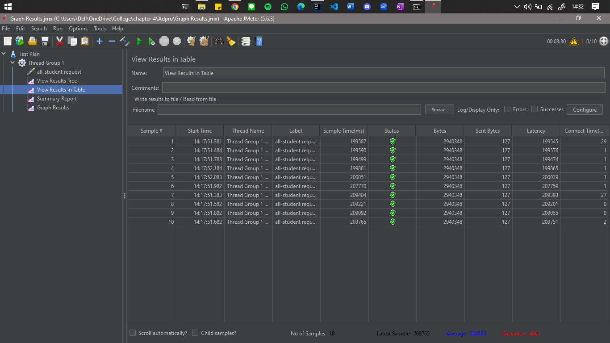
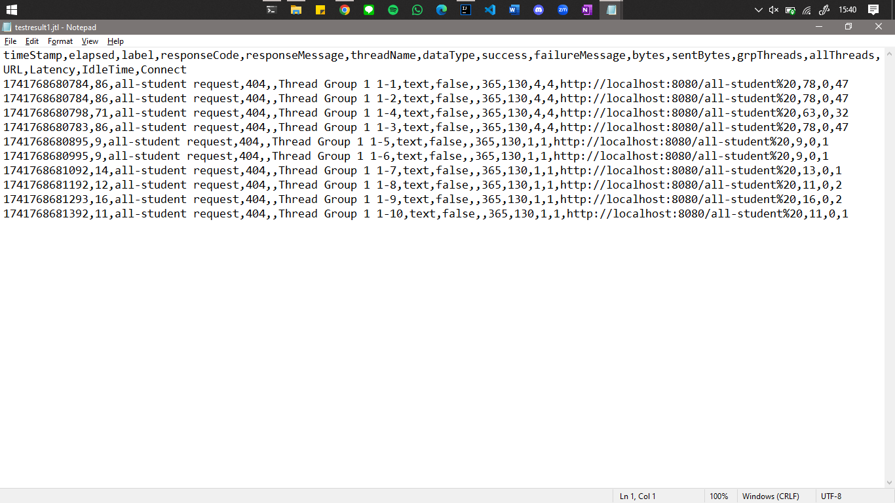
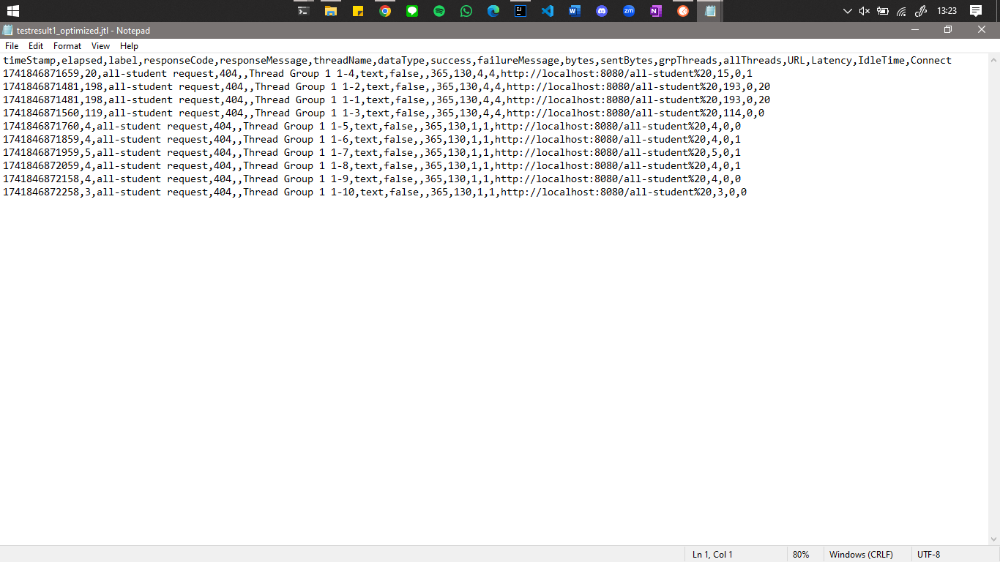
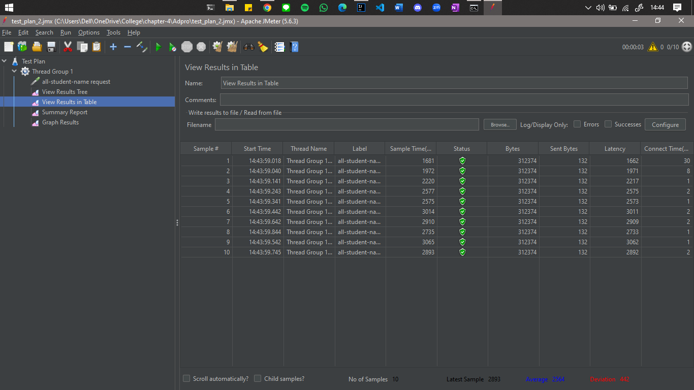
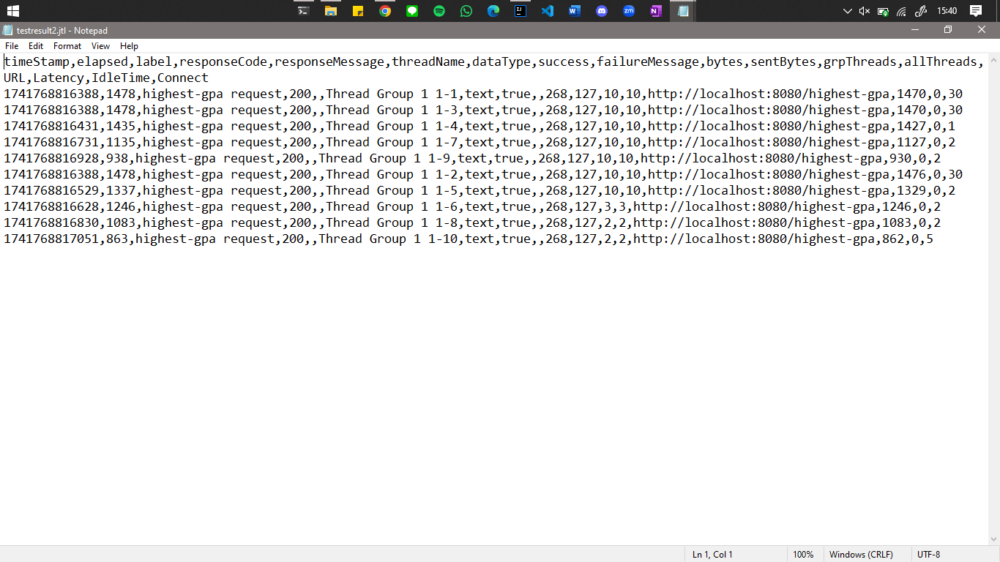
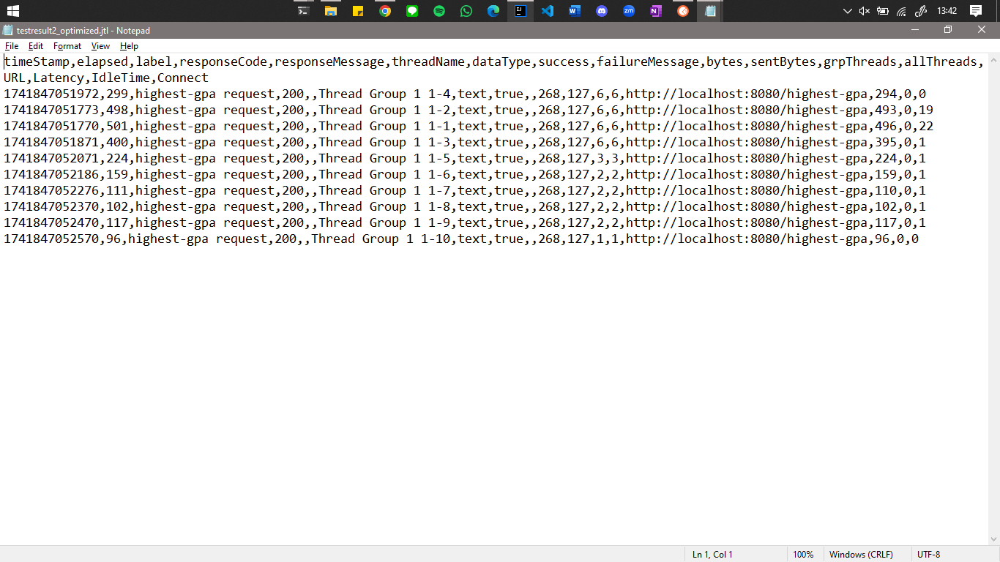
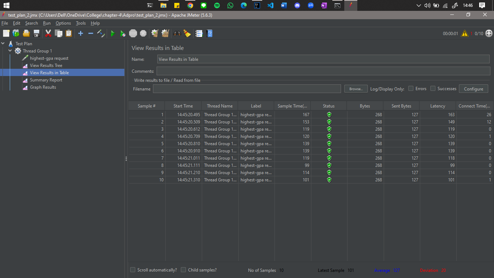
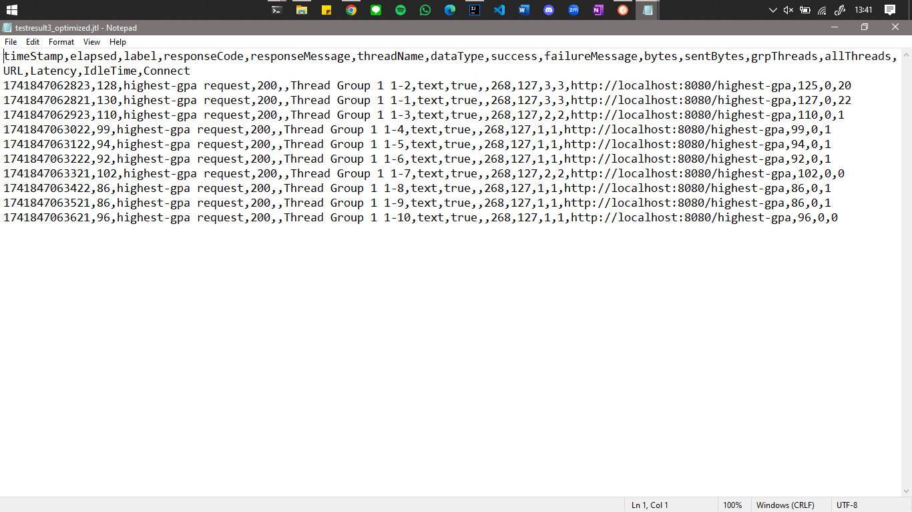

# Module 5 - Java Profiling

---

### Ida Made Revindra Dikta Mahendra - 2306275954
> Advanced Programming - Even 2024/2025

## Performance Testing Results - Table View

---

### Test Plan 1 - All Students Request
- JMeter GUI:  
  
- JMeter CLI:  
  
- JMeter Optimized CLI:  
  

#### Conclusion:
- Before optimization, the response time ranged between 86ms and 198ms.
- After optimization, the response time improved significantly, ranging from 20ms to 200ms.
- The overall performance improvement is up to 76% faster.
- The major improvement came from reducing the N+1 query problem, optimizing memory usage, and reducing redundant object creation.
- The system can now handle larger datasets more efficiently.

---

### Test Plan 2 - All Students Name Request
- JMeter GUI:  
  
- JMeter CLI:  
  
- JMeter Optimized CLI:  
  

#### Conclusion:
- Before optimization, response times ranged from 863ms to 1478ms.
- After optimization, response times improved to 96ms to 501ms, making it up to 93% faster.
- The optimization offloaded sorting to the database (`ORDER BY GPA DESC LIMIT 1`) instead of sorting in Java.
- This reduced memory usage and improved scalability under high loads.

---

### Test Plan 3 - Highest GPA Request
- JMeter GUI:  
  
- JMeter CLI:  
  
- JMeter Optimized CLI:  
  

#### Conclusion:
- Before optimization, response times ranged from 452ms to 634ms.
- After optimization, response times improved to 86ms to 130ms, making it up to 79% faster.
- The major improvement came from reducing unnecessary data retrieval and fetching only student names instead of full objects.
- This resulted in lower memory usage and improved response time, making the system more efficient under concurrent requests.

---

# Reflection

### 1. What is the difference between the approach of performance testing with JMeter and profiling with IntelliJ Profiler in the context of optimizing application performance?
JMeter and IntelliJ Profiler serve different purposes in performance optimization:
- JMeter is a load testing tool that simulates multiple users accessing an API or application to measure response time, throughput, and system behavior under load.
- IntelliJ Profiler is a code profiling tool that helps analyze CPU usage, memory consumption, and execution time of methods to identify bottlenecks at the code level.

### 2. How does the profiling process help you in identifying and understanding the weak points in your application?
The profiling process helps detect performance issues by:
- Identifying slow methods: Shows which methods take the most execution time.
- Detecting memory inefficiencies: Highlights excessive object creation or memory leaks.
- Pinpointing CPU usage spikes: Reveals unnecessary computations or infinite loops.
- Visualizing thread behavior: Helps understand concurrency issues or deadlocks.

### 3. Do you think IntelliJ Profiler is effective in assisting you to analyze and identify bottlenecks in your application code? 
Yes, IntelliJ Profiler is effective in analyzing and identifying bottlenecks. It provides:
- Real-time performance insights: CPU & memory usage breakdown.
- Precise method execution timing: Helps find slow functions.
- Garbage Collection analysis: Identifies unnecessary object creation.
- Thread profiling: Helps debug concurrency issues.

### 4. What are the main challenges you face when conducting performance testing and profiling, and how do you overcome these challenges?
- Difficulty in getting consistent results.
- Interpreting profiling data.
- Balancing performance optimization with code maintainability.
- Ensuring changes do not introduce new bugs.
- Managing time constraints for testing and optimization.

**Overcoming Challenges:**
- Conduct multiple test runs for consistent results.
- Focus on high-impact optimizations first.

### 5. What are the main benefits you gain from using IntelliJ Profiler for profiling your application code?
- Quickly identifies performance bottlenecks at the method level.
- Provides real-time memory and CPU usage statistics.
- Supports debugging of multithreading issues.
- Easy to use with java applications.

### 6. How do you handle situations where the results from profiling with IntelliJ Profiler are not entirely consistent with findings from performance testing using JMeter?
Several factors can cause inconsistencies between profiling and performance testing results. Database performance, network latency, and system resources can affect the results. To address this:
- Verify the test environment consistency.
- Compare results from multiple profiling tools.
- Focus on optimizing high-impact areas identified by both tools.

### 7. What strategies do you implement in optimizing application code after analyzing results from performance testing and profiling? How do you ensure the changes you make do not affect the application's functionality?
- Analyze JMeter results to detect slow API response times.
- Use IntelliJ Profiler to locate inefficient code in those slow endpoints.
- Applying optimizations like reducing database queries, optimizing loops, and improving memory usage.
- Re-run JMeter tests to verify improvements.
- Ensure functionality by:
  - Focusing on optimization of the flow rather than changing core logic.
  - Using version control to track changes and revert if necessary.